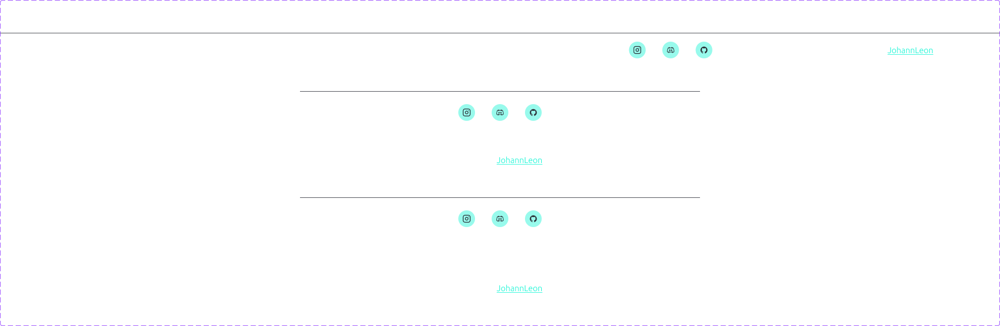

# Final Project

Complete your final project in this Replit.

You’ve learned a ton about HTML, CSS, and the web in this course. The final project is your chance to build a website of your own design from scratch.

[Click the Instructions.md tab for instructions.]

[Update this file to describe your project! You can remove the instrcutions in the brackets]

## Project Authors
- [Sanusi Rukayat Temitope]
- [Adesina Busolami Temiloluwa]
- [Your name here]

## Description
[This project is a recreation of SinanTokmak's Web Developer Portfolio Website Template (Community) on figma. A section of the thumbnail as well as the footer section of the UI Kit was used. Find below an attached image of the template

“We're just a beginner, and this was our student project”]